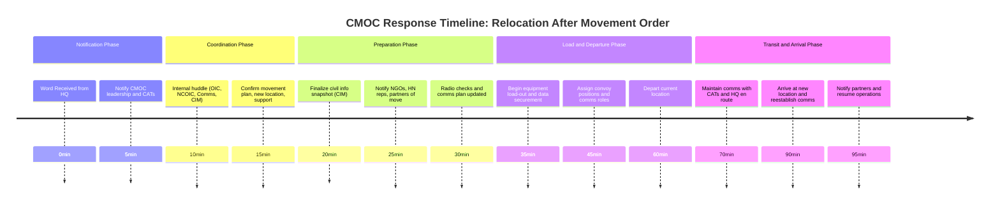

### MOBILITY REQUIREMENTS
## this is a test

Mobility requirements vary based on the types of unit(s) supported and the same supported unit(s) mission.

>Note: The gear you bring and how mobile your team needs to be depends on who you're supporting, what they're doing, and where they're going.

#### Key Terms:
-   ***Mobility requirements***: How much of the CMOC (or other CA elements) needs to be able to move, how quickly, and with what gear.

`perez - loadpln`
>note : break down of what we need
the manual [https://irp.fas.org/doddir/army/atp3-57-70.pdf]

>Note: The standard for displacing
the main CP is *45 minutes* from the time the command to move is issued until the first vehicle
hits the start point

CMOC Attached to HQ Element – What Shifts?
🧭 Purpose Refined
Act as a central coordination node between civil entities and the HQ staff.

Serve as the civil component’s lens into the COP (Common Operational Picture).

Feed situational awareness, assessments, and recommendations to the S-9/G-9 and commander.

Enable synchronization of civilian and military efforts at the operational level.

### Senario: CMOC Attached to HQ Element (making a jump)

| Area                      | Things to consider as a CMOC attached to a HQ element                                                                     |
| ------------------------- | ------------------------------------------------------------------------------------------------ |
| **Mobility**              | Less focus on speed, more on capability. May stay semi-static longer.                            |
| **Size/Footprint**        | Increases: multiple tents, briefing areas, comms, guest access space.                            |
| **Staffing**              | Includes CA staff, linguists, liaison officers, CIM cell, planners.                              |
| **Comms & Reporting**     | Direct tie-ins to the main TOC/JOC for live updates. Persistent comms with CA teams.             |
| **Security**              | Higher-profile = increased force protection. Designated access points.                           |
| **CIM Tools**             | More advanced — shared network drives, SharePoint, SIPR/NIPR systems, large civil info displays. |
| **Visitors/Coordination** | Expect recurring engagement with USAID, NGOs, IGOs, HN reps, Red Cross, etc.                     |

Key Requirements
-   Civil-Military Working Group Schedule: Sync points with S3, G9, Legal, PAO, and external stakeholders.

-   Access to SIPR/NIPR systems: For reporting, synchronization, and secure messaging.
-   Shared understanding with TOC/JOC: S3, S2, S9 must know where you plug into the battle rhythm.
-   Redundant comms with CATs: HF/SAT backup, daily check-ins, emergency plans.
-   Briefing capability: Setup to present directly to the commander/staff on civil matters.
-   Tracking systems: Excel/CIM systems for HA/DR ops, civil unrest reports, population data, etc.
-   Logistics plan: Sustainment aligned with HQ footprint; account for power, water, hygiene, billeting.
-   Relocation plan: Contingency for TOC jump — what moves, what stays, what gets cached.

“We’re Moving” – The CMOC Response
🕓 T+0 Minutes: Word Received
You receive official confirmation via S3/S9 channels (radio, TOC brief, or FRAGORD).

Immediately notify CMOC leadership and begin initiate-movement protocol.

Notify all Civil Affairs Teams (CATs): “Standby — movement order received. Update to follow.”

🗺️ T+5–15 Minutes: Internal Huddle
Convene key CMOC personnel: OIC/NCOIC, CIM lead, comms NCO, interpreter/liaison.

Confirm timeline, new location (if known), support structure (e.g., route security), and movement method (convoy, helicopter, staggered loadout).

Determine if split operations are needed (e.g., rear cell remains temporarily to finish coordination).

🛠️ T+15–30 Minutes: Execution Prep
Civil Info Wrap-Up:

Final snapshot of the civil operational picture (CIM summary).

Mark any open civil engagements, pending meetings, aid deliveries, etc.

Begin saving/uploading civil data to shared systems.

Partner Notifications:

Message out to NGOs, HN reps, USAID, etc. that CMOC is relocating.

Share new comms plan and ETA for reestablishing coordination.

COMMS:

Secure encryption keys (KEK, TSK, etc.) if rotating.

Radio checks with all CATs.

Coordinate new frequencies or pre-set “relink” times.

📦 T+30–60 Minutes: Loadout
Follow pre-determined load plan:

Tactical gear, radios, laptops, CIM maps, civil engagement records, power systems.

Secure sensitive info (burn bags or lockboxes for hard copy data).

Ground guides report to convoy marshal.

Assign convoy positions: Lead vehicle has radio and map for CAT routing.

In Transit
At least one radio-equipped vehicle maintains comms with CATs and main HQ.

A designated CMOC NCO monitors the TOC net and civil net, relaying updates.

If possible, send location pings or time hacks (“CMOC en route, ETA 45 min”).

🛬 Upon Arrival
Set up interim comms immediately (even if tents aren’t up).

Notify CATs and partners: “CMOC established at new location.”

Resume info flow:

Update TOC and S9/G9 on CMOC readiness status.

Push out any deferred messages/briefs to civil partners.

Key Principles
Continuity over comfort: The CMOC moves, but comms and awareness must never fully drop.

Inform, not surprise: Everyone using the CMOC as a hub (CATs, NGOs, S-Staff) should already know you’re relocating by the time you do.

Secure the narrative: Before and after the jump, the CMOC controls the civil story for that battlespace — what’s happening, who’s impacted, and what’s next.